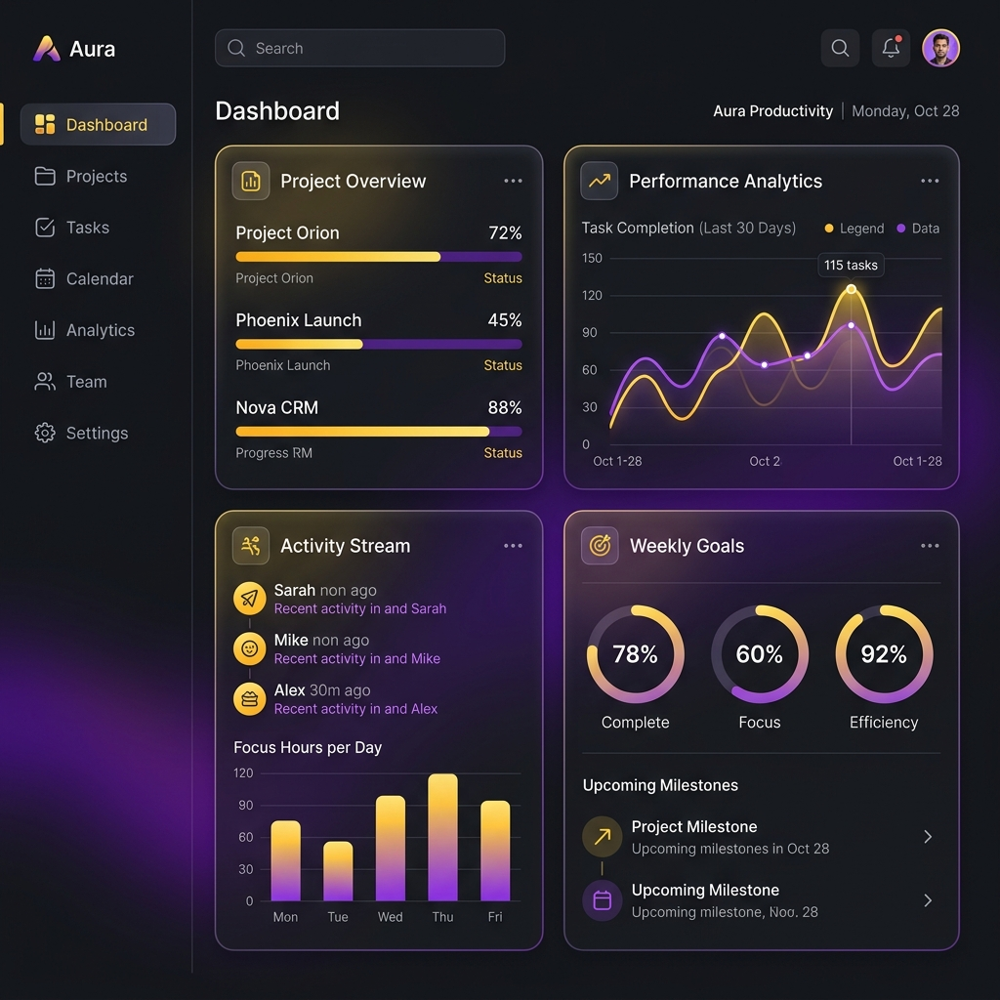
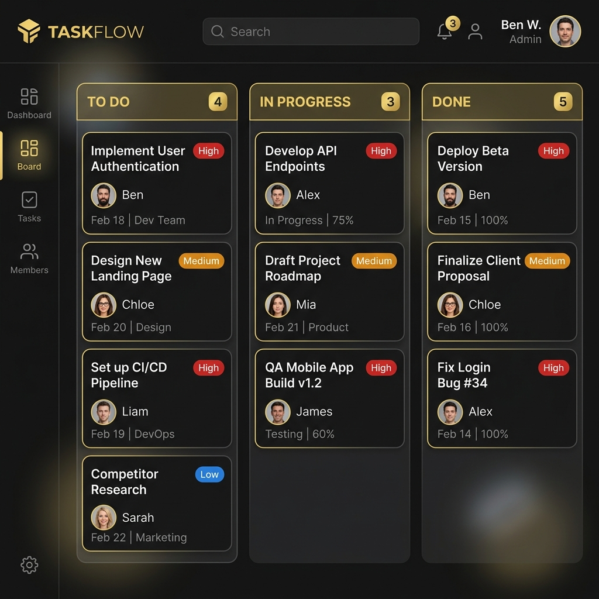

# 🚀 FlowBoard - Premium SaaS Dashboard



FlowBoard, modern web teknolojileriyle geliştirilmiş, hem bireysel kullanıcılar hem de ekipler için tasarlanmış yüksek performanslı bir verimlilik ve yönetim panelidir. Üst düzey estetiği güçlü işlevsellikle birleştirerek, günlük işlerinizde "akış" (flow) haline geçmenize yardımcı olur.

---

## ✨ Öne Çıkan Özellikler

### 📊 Dinamik Kontrol Paneli (Dashboard)
Verimliliğinizin kuş bakışı görünümü. Etkileşimli grafikler, gerçek zamanlı analitikler ve kritik performans göstergeleri (KPI) ile durumunuzu anlık olarak takip edin.
- Haftalık verimlilik trendleri
- Görev dağılım animasyonları
- Ekip performans skorları

### 📋 Gelişmiş Kanban Panosu
Görevlerinizi sürükle-bırak arayüzü ile kolayca yönetin. Öncelik seviyeleri, üye atamaları ve alt görev takibi ile hiçbir detayı kaçırmayın.
- **Drag & Drop:** `@dnd-kit` ile pürüzsüz kart ve sütun taşıma.
- **Detaylı Görevler:** Etiketler, bitiş tarihleri ve açıklama alanları.
- **Filtreleme:** Öncelik seviyesine göre anlık görev süzme.



### ⚡ Odaklanma Modu (Focus Mode)
Derin çalışma (deep work) için özel bir alan. Dahili Pomodoro zamanlayıcısı ve dikkat dağıtıcı unsurlardan arındırılmış arayüz ile üretkenliğinizi zirveye taşıyın.
- Ayarlanabilir çalışma ve mola süreleri.
- Oturum geçmişi ve istatistik takibi.
- Rahatlatıcı görsel geri bildirimler.


### 📝 Entegre Notlar
Fikirlerinizi anında kaydedin ve dokümantasyonunuzu platformdan ayrılmadan yönetin.
- Renk kodlu not kategorileri.
- Önemli notları başa tutturma (pin) özelliği.
- Hızlı arama ve filtreleme.


### 👥 Ekip İşbirliği
Ekip üyelerini yönetin, görev atamalarını takip edin ve kolektif performansı optimize edin.
- Üye çevrimiçi/çevrimdışı durumu.
- Bireysel performans skorları.
- Görev yükü dağılımı.

---

## 🛠️ Teknoloji Yığını

- **Frontend:** [React.js](https://reactjs.org/) (Vite altyapısı ile)
- **Stil Yönetimi:** [Tailwind CSS](https://tailwindcss.com/)
- **Durum Yönetimi:** [Zustand](https://github.com/pmndrs/zustand)
- **Animasyonlar:** [Framer Motion](https://www.framer.com/motion/)
- **Grafikler:** [Recharts](https://recharts.org/)
- **İkon Seti:** [Lucide React](https://lucide.dev/)
- **Sürükle-Bırak:** [@dnd-kit](https://dndkit.com/)

---

## 🚀 Başlangıç

### Ön Gereksinimler

- Node.js (v18 veya üzeri)
- npm veya yarn paket yöneticisi

### Kurulum Adımları

1.  **Projeyi klonlayın:**
    ```bash
    git clone https://github.com/kullanici_adiniz/flowboard.git
    cd flowboard
    ```

2.  **Bağımlılıkları yükleyin:**
    ```bash
    npm install
    ```

3.  **Geliştirme sunucusunu başlatın:**
    ```bash
    npm run dev
    ```

4.  **Tarayıcınızda açın:**
    Uygulamayı görmek için tarayıcınızda `http://localhost:5173` adresine gidin.

---

## 📂 Proje Yapısı

```text
src/
├── components/     # Tekrar kullanılabilir UI bileşenleri
├── pages/          # Sayfa görünümleri (Dashboard, Tasks, Focus vb.)
├── store/          # Zustand state yönetimi
├── data/           # Mock veri setleri
├── assets/         # Statik varlıklar
└── index.css       # Global stiller ve Tailwind konfigürasyonu
```

---

## 📄 Lisans

Bu proje MIT Lisansı ile lisanslanmıştır - detaylar için [LICENSE](LICENSE) dosyasına göz atabilirsiniz.

---

Verimlilik için ❤️ ile geliştirildi.
